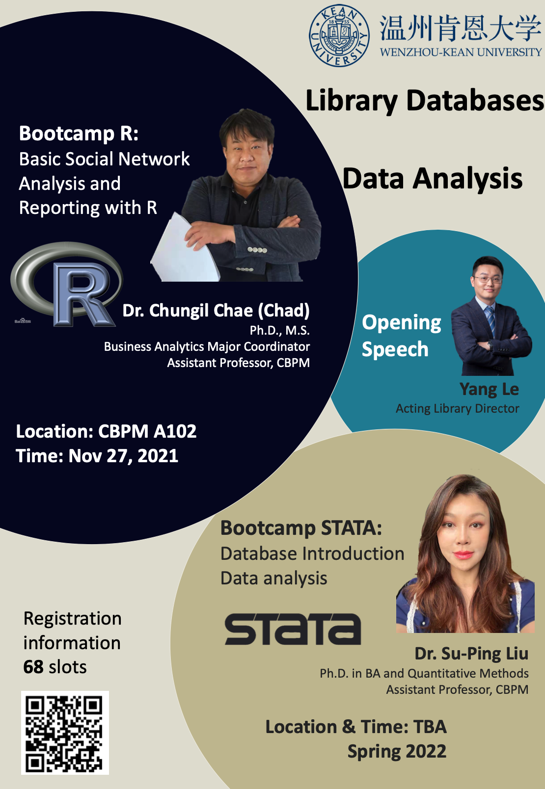

--- 
title: "Wenzhou-Kean University Data Analysis Bootcamp Series"
author: "Chungil Chae(Chad)"
date: "`r Sys.Date()`"
site: bookdown::bookdown_site
documentclass: book
description: 
link-citations: yes
github-repo: "https://chadchae.github.io/ws_ba_bootcamp_2021/"
---

# About Bootcamp Series

*Organizer: WKU Library*

- Session1: Bootcamp R: Basic Social Network Analysis and Dynamic Reporting with R
  - CBPM A102
  - Nov 27 (SAT)
  - 10:30 AM
- Session2: Bootcamp Stata: Database Introduction Data Analysis
  - Location (TBA)
  - Date (TBA)
  - Time (TBA)

{ width=600px }

## Objective and Introduction
The Bootcamp is addressed to undergraduate students at Wenzhou-Kean University. It represents a unique opportunity to attend lectures on library database exploration and data analysis instructed by expert faculty and receive feedback both on developed (senior theses) and developing projects (early-stage ideas).